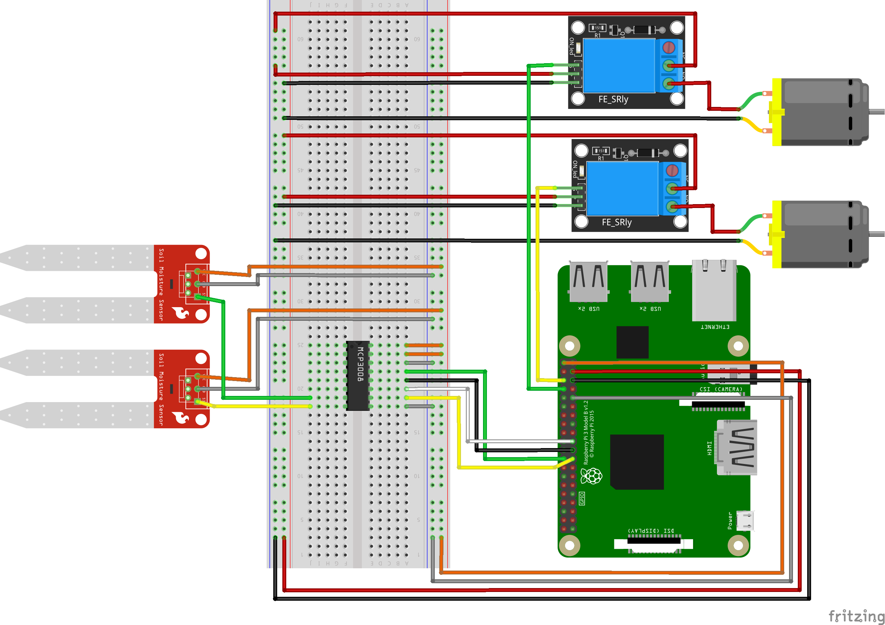

# waterpi

## What is this?

Self watering system for plants using a raspberry pi. 

## How?

It uses a MCP3008 chip for reading analog values from a moisture sensor, so it can take up to 8 plants at the same time. It expects one pump per plant, since each plant will be monitored individually.

## Components

These are the components that are expected for monitoring one plant:
- 1 Raspberry PI 3 or above with SPI interface ([For more info](https://raspberrypi-aa.github.io/session3/spi.html))
- 1 Humidity sensor. I've installed a capacitive sensor, since I read that resistive ones are more prone to corrosion. Didn't verify this information, but I went with a capacitive sensor nonetheless
- 1 MCP3008 chip. Translation from analog humidity sensor to digital
- 1 Relay. Provides control with logical voltage to higher voltage
- 1 water pump that can run with 5V that the raspberry offers
- Plastic tubing for getting the water from the pump to the plant

## Schematics

For the connections schematics. I strongly recommend using [this page](https://pinout.xyz/#) as documentation on the side. It has all documentation needed for a raspberry pi gpio.
The program used to make the schematics is [fritzing](https://fritzing.org/) (No longer free but still open source).

More than one humidity sensor and pump were added to indicate that more than one set can me monitored at the same time. Keep in mind that sensor and pump pair can be added or removed up to a maximun of 8 (MCP3008 analog inputs limit).

## Metrics

Metrics are exposed. This is to be able to track them via prometheus, or any other compatible software. They are hardcoded to be on port 8080 under on the path `/metrics`.
Originally, it was used with a combination of prometheus and grafana, having alerts and such.

## Configuration

The prefered format for configuring waterpi is [hjson](https://hjson.github.io/), an improved human friendly-wise set of json, but raw json is also supported.
An example of the configuration can be found [here](/config.hjson).

### Assumptions

The project assumes that the sensor's values are queried on a regular basis. It react to it, and it becomes the system's *de facto* clock. The logic for watering and such, will be executed only when a new value from the sensor comes. Be aware that it's originally used a querying frequency of 1 second.